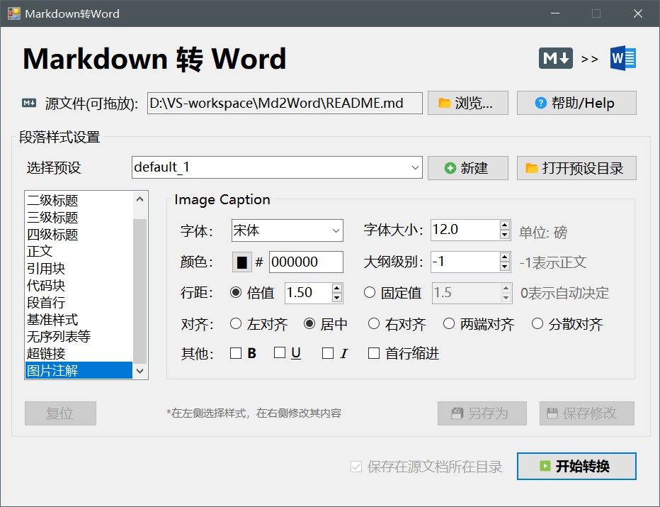
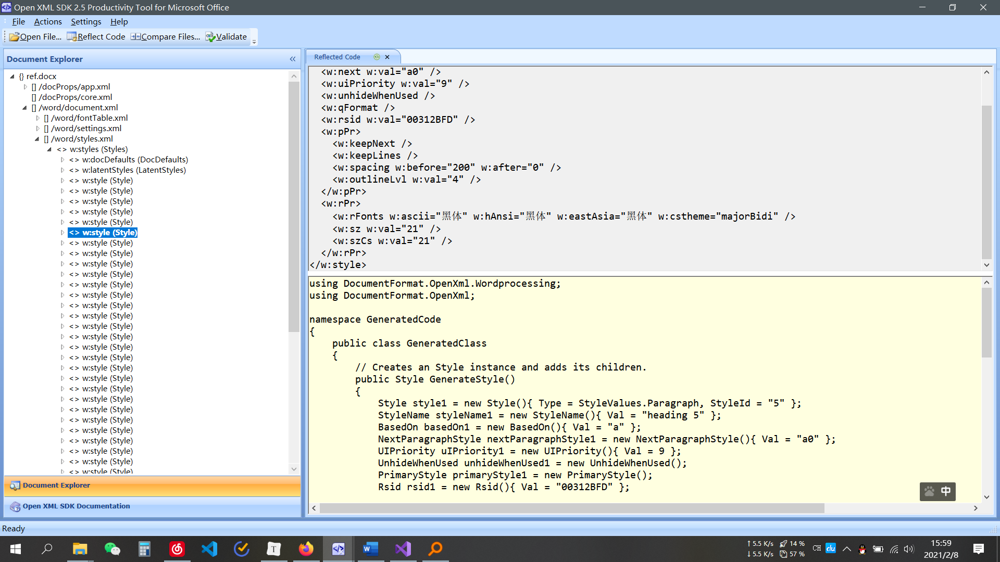

# 敬请留意

本项目已不再更新。我正在使用 Python 重写本工具，更好地跨平台，更灵活地样式设置，**并且不依赖pandoc**。

想要关注的朋友可以在 [置顶issue](https://github.com/greyovo/md2word-pandoc/issues/6 ) 中留言，有进展之后我会通知你~

# MD2Word-Pandoc



一个使用 C#编写的、基于[Pandoc](https://github.com/jgm/pandoc)的 markdown 转换 word 工具。其本质是在 Pandoc 的基础上提供一个 GUI 界面，方便操作。初学 C#和 Winform 的作品，还在摸索阶段，有更好的思路或找到了 bug 可以留 issue，我都会看到并且回复的 :)

> 注意！本项目还在开发当中，并且要求系统安装 Pandoc。已基本实现转换和样式保存导出功能，GUI 界面还未完成，目前阶段的使用方法见 [使用方法](#使用方法)

## 自助转换

一般而言，我使用 [Typora](https://www.typora.io) 编写 Markdown，而 Typora 中自带有导出 HTML 格式的功能。如果对文档中的代码高亮没有要求，可以通过以下步骤进行转换为 Word 文件，效果也还不错。

1. Typora 中：文件 - 导出 - HTML(without Styles)。
   > 一定要选 without style，这样导出的就是纯净的 HTML 文件
2. 打开 HTML 文件，全选，复制
3. 新建 Word 文档，粘贴（保留源样式）。到这就基本完成了，目录大纲级别也会被保留
4. 如果需要，可以修改样式，比如全选减小字号、更换字体、行距等等

## 为什么做这个

在接触了 markdown 之后，越发觉得 Word 调节样式非常繁琐了，但无奈平时的实验报告又不得不上交 Word 版本，转了一圈也没有找到一个好用的 markdown 转 word 工具。而 Pandoc 默认的 Word 样式在中文状态下不美观，于是萌生了编写此工具的想法。

## 本项目功能

### 基本

- [x] 由.md 文件转换为一个排版样式尚可的 Word 文档。转换出的 Word 的字符、段落样式符合中文的书写和显示习惯（如段首缩进、行间距、字体的选择等）
- [x] 段落样式可供设置的内容：字号、字体、段落间距、颜色、（加粗、斜体、下划线？）等
- [x] 提供可视化界面，样式可由用户方便地设置
- [x] 拖拽即可导入文件
- [ ] 软件自带有若干个样式预设
- [ ] 可以保存预设，可以导入、导出样式预设

### 更进一步

- [ ] 读取 md 文件的 yaml 信息来进行自动样式设置
- [ ] 提供论文排版模式，即在首页之前添加特定的封面、处理参考文献等
- [ ] 根据 MD 的大纲级别制作目录
- [ ] 制作一个精简版的 pandoc 依赖，只需要其中的 md 转换 docx 的功能，从而简化软件体积

## 使用方法

注意，要求系统已安装[Pandoc](https://github.com/jgm/pandoc)。测试所用的版本为 2.7.2，理论上更高版本也可行，但未测试。

> 测试阶段，未来应该会完善 :)

0. 前往[Release](https://github.com/greyovo/md2word-pandoc/releases)页面下载 zip 并解压，运行其中的 exe 文件
1. 拖入 `.md` 文件到窗口中
2. 下拉菜单选择预设，或修改样式
3. 执行转换
4. 转换出的 docx 文件将保存在与源 md 的同目录下

可对该 xml 文件进行修改，以满足自己的样式需求。

## 实现思路

> 有更好的思路、方法可以留 issue，我会看到的

1. 关键：根据用户的样式设置，生成一个可供 pandoc 转换时使用的临时`template.docx`——使用 Office Open XML SDK 操作

   1. 创建一个新的临时的 docx
   2. 根据 pandoc 参照模板，生成若干段落样式
   3. 向临时的 docx 中添加这些段落样式
   4. 保存并关闭这个 docx

2. 调用 pandoc。使用以下命令：

   ```shell
   pandoc -o output.docx input.md --reference-doc=template.docx
   ```

   解释：由源 md 文件`input.md`参照`template.docx`中的样式列表生成 Word 文档`output.docx`。

3. 使用 JSON 或 XML 保存样式预设，用于导入和导出分享、保存样式信息

### 核心步骤

```csharp
string path = @"C:\Users\59838\Desktop\test.docx";

// 1.创建一个新的临时的docx
CreateWordprocessingDocument(path);

// 2.打开刚刚创建的新文档
WordprocessingDocument wordDocument =
    WordprocessingDocument.Open(path, true);

// 3.获取样式定义部分实例
StyleDefinitionsPart part = GetStyleDefinitionsPart(wordDocument);

// 4.根据要求生成样式Style实例
Style style = GenerateStyle();

// 5.将4中生成的实例，通过3获取的实例，添加到样式管理（文档的样式库）中
AddParagraphStyle(part, style);

// 6.将更改保存并关闭文件（重要）
wordDocument.Close();
```

## 有用的资料

### Pandoc User's Guide

Pandoc 转换时参考的样式，要求 StyleName 和 StyleId 两个属性共同满足其给出的模板中对应的样式名称和 ID

[完整的 Pandoc User's Guide](https://pandoc.org/MANUAL.html#pandocs-markdown)

### 段落样式

| 样式名          | 描述                                                                    | 必须 |
| --------------- | ----------------------------------------------------------------------- | ---- |
| Normal          | 默认文本。在有序列表中会使用该样式，一般和 Body Text 一致并禁用首行缩进 | 是   |
| Body Text       | 正文文本。在正文段落中应用                                              | 是   |
| First Paragraph | 段落首段，一般和 Body Text 一样即可，在段落的第一行应用                 | 是   |
| Compact         | 在无序列表中应用                                                        | 是   |
| Heading 1       | 一级标题                                                                | 是   |
| Heading 2       | 二级标题                                                                | 是   |
| Heading 3       | 三级标题                                                                | 是   |
| Heading 4       | 四级标题                                                                | 否   |
| Block Text      | 引用块文字                                                              | 是   |

更多：

- Heading 5
- Heading 6
- Heading 7
- Heading 8
- Heading 9
- Footnote Text“脚注文字，可选
- Definition Term：未知
- Definition：未知
- Caption：未知
- Table Caption：表的的注释，可选
- Image Caption：图片的注释，可选
- Figure：未知，可能是图表
- Captioned Figure：未知，可能是带标题的图表
- TOC Heading：目录标题
- Title：标题，可选
- Subtitle：副标题，可选
- Author：作者，可选
- Date：日期，可选
- Abstract：未知，可选
- Bibliography：参考文献，可选，具体使用未知

### 字符样式

| 样式名称               | 描述                       | 必须 |
| ---------------------- | -------------------------- | ---- |
| Default Paragraph Font | 默认段落字体               | 是   |
| Body Text Char         | 正文字体                   | 是   |
| Verbatim Char          | 等宽字体（在代码块中用到） | 是   |
| Footnote Reference     | 脚注引用字体样式           | 否   |
| Hyperlink              | 超链接字符样式             | 是   |

### 表格样式

- Table：待补充

### 所需依赖

- 必需：WindowsBase（.NET Framework 自带）

- 必需：Open XML SDK 2.5 for Microsoft Office

  - 下载：<https://www.microsoft.com/en-us/download/details.aspx?id=30425>

  - 在 VS 中引入：<https://blog.csdn.net/CoingSun/article/details/105754924>

- 可选：OpenXMLSDKTool，用于查看 Word 文档中的各项内容



### Microsoft 官方文档

[主要] Office Open XML SDK 字处理 概述

[https://docs.microsoft.com/zh-cn/office/open-xml/word-processing?view=openxml-2.8.1](https://docs.microsoft.com/zh-cn/office/open-xml/word-processing?view=openxml-2.8.1)

### 设置值换算公式

记录使用 SDK 操作 Word 时，一些取值的换算方式。一般而言，默认字体大小、行距大小的单位都是磅。

#### 行距

| 行距倍数 | 设置值   |
| -------- | -------- |
| 1        | 240      |
| 1.15     | 276      |
| 1.5      | 360      |
| 2        | 480      |
| n        | 240 \* n |

```csharp
new SpacingBetweenLines()
{
    Line = "276", // 此值表示设置了1.15倍行距
    LineRule = LineSpacingRuleValues.Auto
};
```

固定行距计算

$$
固定行距的设置值 = 磅值×20
$$

```csharp
new SpacingBetweenLines()
{
    Line = "400", // 表示在固定值模式下设置了行距为20
    LineRule = LineSpacingRuleValues.Exact
};
```

##### 字体大小

Word 中设置字号大小 n 磅，那么在代码层面的值是 2n 。比如在 Word 中字号设置为 14 磅，那么代码中的值取 14×2=28

```csharp
new FontSize() { Val = "28" } // 表示字体大小设置为了14磅
```

##### 缩进

首行缩进字符数

$$
FirstLineChars = 字符数×10
$$

```csharp
new Indentation()
{
    FirstLineChars = 200 // 表示首行缩进两个字符
};
```

| 字号 | 磅   |
| ---- | ---- |
| 初号 | 42   |
| 小初 | 36   |
| 一号 | 26   |
| 小一 | 24   |
| 二号 | 22   |
| 小二 | 18   |
| 三号 | 16   |
| 小三 | 15   |
| 四号 | 14   |
| 小四 | 12   |
| 五号 | 10.5 |
| 小五 | 9    |
